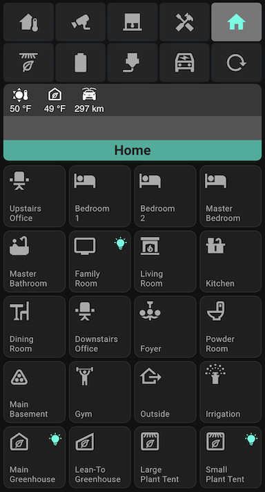

# hass-mobile-one-screen
> This is a home assistant UI implementation leveraging various integrations to achieve a non scrolling mobile friendly interface

## Table of Contents
* [General Info](#general-information)
* [Technologies Used](#technologies-used)
* [Features](#features)
* [Screenshots](#screenshots)
* [Setup](#setup)
* [Usage](#usage)
* [Project Status](#project-status)
* [Room for Improvement](#room-for-improvement)
* [Acknowledgements](#acknowledgements)
* [Contact](#contact)
<!-- * [License](#license) -->

## General Information
I wanted to achieve a UI for home assistant that would all be displayed on a single screen of my iphone.  I didnt want to have to scroll to see various entities and their states.  Leveraging various popups and state icons i can see what's going on in our house and interact with it easily.  This is still very much work in development and I have a lot of cleaning up to do but what I will show here has been working for me for a while.  

Oh and I'd like to come up with a better name for whatever this is, suggestions welcome.

Most of this is implemented leveraging the [custom button card](https://github.com/custom-cards/button-card) for home assistant.  This is a fantastic card that has so many capabilities.  There were several times where I would find a module in HACS to do something but then I'd realize I could make one better but just implementing using the custom button card.   More on that below. 

## Technologies Used
- Tech 1 - version 1.0
- Tech 2 - version 2.0
- Tech 3 - version 3.0

## Features
List the ready features here:
- Awesome feature 1
- Awesome feature 2
- Awesome feature 3

## Screenshots

<!-- If you have screenshots you'd like to share, include them here. -->

## Setup
What are the project requirements/dependencies? Where are they listed? A requirements.txt or a Pipfile.lock file perhaps? Where is it located?

Proceed to describe how to install / setup one's local environment / get started with the project.

## Usage
How does one go about using it?
Provide various use cases and code examples here.

`write-your-code-here`

## Project Status
Project is: _in progress_ / _complete_ / _no longer being worked on_. If you are no longer working on it, provide reasons why.

## Room for Improvement
Include areas you believe need improvement / could be improved. Also add TODOs for future development.

Room for improvement:
- Improvement to be done 1
- Improvement to be done 2

To do:
- Feature to be added 1
- Feature to be added 2

## Acknowledgements
Give credit here.
- This project was inspired by...
- This project was based on [this tutorial](https://www.example.com).
- Many thanks to...

## Contact
Created by [@flynerdpl](https://www.flynerd.pl/) - feel free to contact me!

<!-- Optional -->
<!-- ## License -->
<!-- This project is open source and available under the [... License](). -->

<!-- You don't have to include all sections - just the one's relevant to your project -->
